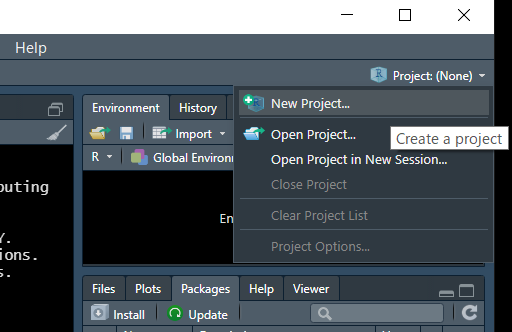
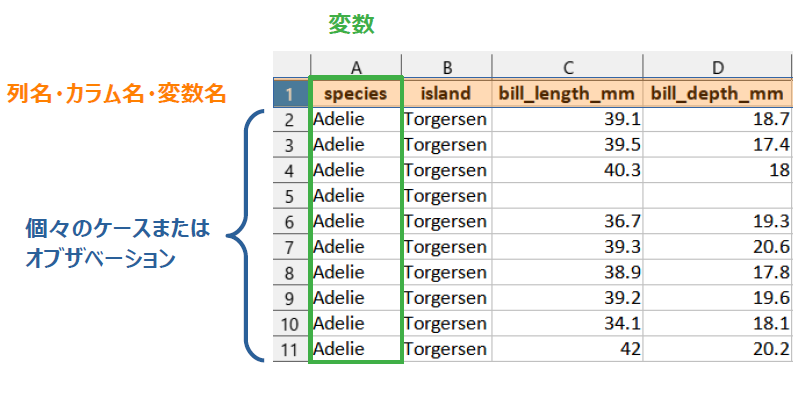

# 前提知識 {#premise}

* 

## 本書に出てくるコード部分の見方{#p-howtoread}

* グレーの背景部分はRのコードが書いてあり，その下の`##`で始まる部分は出力結果を表す

```{r}
1 + 1
```

* ここでは`1 + 1`がコード部分で，`## [1] 2`が出力結果部分
* `[1]`というのは，その次にくる値（ここでは１つしかないが）が何番目にあるかを示している
* たとえば，1から50までの数値を出力してみる
  + コロン`:`で最初と最後の値をつなぐことで連番を表現できる

```{r}
1:50
```

* コード部分に`#`で始まる文章がある場合は，コメントを表す。ここは実行されないので説明のために書かれる

```{r}
# *（アスタリスク） は掛け算であることを示す

2 * 3  # ここにもコメントを入れられる
```


## プロジェクト{#p-project}

* データを加工して解析する際に、1つのフォルダ（サブフォルダも含む）の中に関連するデータやコードなどをまとめておき、そのフォルダを __プロジェクト__ と設定する
* これにより、ファイルの読み書きの際の場所指定をいちいち意識しないで作業できるようになる
* 詳しくは[拙書の解説](https://izunyan.github.io/excel_r/project.html#project)参照



## パッケージ{#p-package}

* 様々な関数やデータなどがまとまっていて，読み込むと色々なことができる
  + 逆にいえば読み込まないと便利な作業ができないことが多い
* 例：`library(tidyverse)`または`require(tidyverse)` のように書くことで読み込める
* パッケージを読み込まなくても，`パッケージ名::関数名( )`でパッケージ内の関数が使える
  + どのパッケージの関数か明示するのにも便利なので，本書では多用する
  + 以下，例えば「パッケージ`dplyr`の関数`select( )`」は`dplyr::select( )`と表現する

## 関数{#p-function}

* 適切な値や変数などを指定すれば，データの処理や計算，統計解析など様々な処理を簡単に実行してくれる
* 例えば`mean( )`などのように`関数名( )`で出てくるので，`( )`で囲まれてる所を見たらほぼ関数だと思えばよさそう
* `( )`の中に入る値を __引数__ （ひきすう）と呼ぶ
* 引数は`,`でつないで追加していき，これによって実行したい処理のカスタマイズが可能
　 + 関数の`( )`の最初の位置に来るものを __第一引数__ という

### 例{#p-function-ex}
#### 複数のものを1つにする: c( ){#p-function-ex-c}

*  __ベクトル__ を作る（複数のものを1つにする）ための関数。
* 慣れてる人は当たり前に使っているので，初学者にとって理解しとくとよい最重要関数と思われる
* ベクトルは，後に解説するデータフレームでの列単位のデータを扱う際にも有用

```{r}
c(1,2,3)

c("a", "b", "c") # " "で囲まれる値は文字を表す

# 複数あるように見えるが実は1つのベクトルになっている例
1:10

```

#### 平均値：mean( ){#p-function-ex-m}

* 引数にベクトルを入れることで平均値を計算する

```{r}
mean(c(1,2,3))

# 欠損値（NA）があると結果がNA
mean(c(1, NA, 3))

# 引数にna.rm = TRUEを追加すると結果が出る。基本的に実務上は常につけておいたほうがよい
mean(c(1, NA, 3), na.rm = TRUE)


```


## オブジェクト{#p-object}

* 計算の結果や，複数の数値や文字など（他にも色々）を1つの文字列に格納することができ，その後のコードで活用できる
* `<-`の矢印の先にあるのがオブジェクト。RStudioではショートカット`alt + -`で出せる(Macは`Option + -`)
* この後説明するデータフレームもオブジェクトに入れられる
  + データの少ないミニデータを作る時や，計算結果を格納するときに多用

### 例{#p-object-ex}
```{r}
res <- 1 + 1
res

res2 <- c(1, 2:4, 5)
res2

res3 <- c("a", "b")
res3

rm(res, res2, res3)
```


## データフレーム{#p-df}

* 変数（列）とケースまたはオブザベーション（行）が碁盤の目のようになった集まりの形のデータ。Excelで表現するのであれば通常1行目に列名が入り、2行目以降が個別のデータを表す形
  + データ解析において便利で分かりやすいため、本書ではデータフレームの形で説明していく
  + Rのモダンな方法では，データの加工や統計処理のプロセスをデータフレームの形で返すことが多い





* オブジェクトに格納することで，別のデータフレームを作れる
* 列単位で取り出すとベクトルになる
* 本書では，データフレームの中でも表示に便利なtibble形式を使う
* 本書では紙面の都合上，表示行数をしぼっているが，任意の行数を見たいときは`print( )`関数で出力ごとに設定

### 本書で使う主なデータ
#### ペンギンデータ


* `palmerpenguins`パッケージのpenguinsデータ（CC0）


## %>% （パイプ演算子）{#p-pipe}

* RStudioのショートカットは`Ctrl + Shift + M`(Macは`Cmd + Shift + M`)
* R version 4.1からは`|>`が大体同じ機能を持つ演算子して実装されたので，特にパッケージの読み込みをせずに使えるようになった。こちらを使う説明も今後増えていくと思われる
  + ショートカットで出るパイプを切り替えたい場合は，RStudioの`Tools > Global Options > Code > Editing > use native pipe operator`にチェックを入れる
  + 現時点ではデータフレームを第一引数へ渡す形式でない関数の場合（`lm( )`など），工夫が必要な場合があるようなので，本書では`%>%`を使用