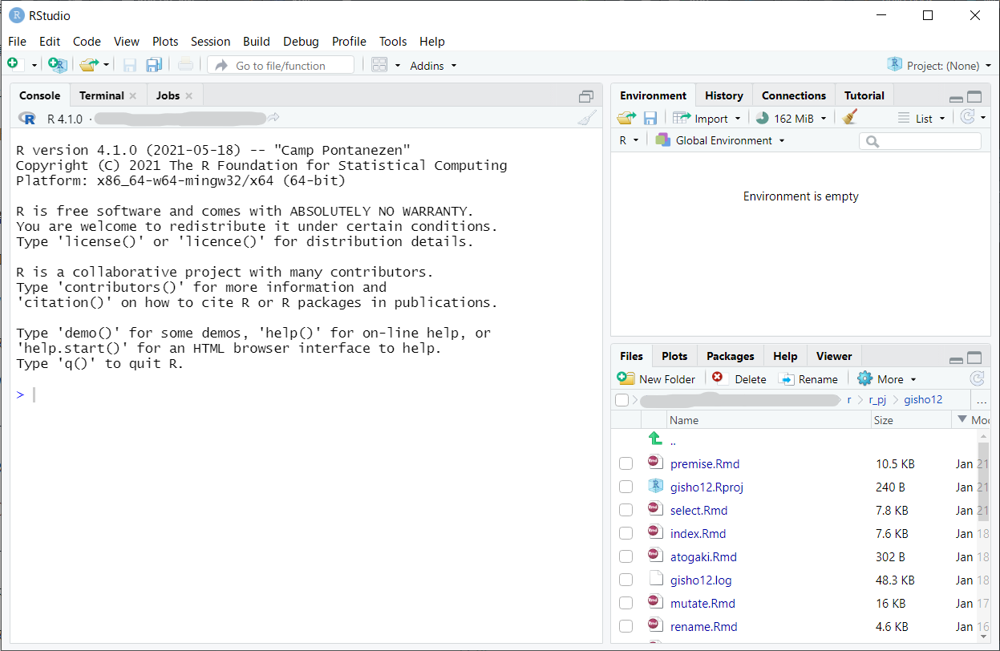
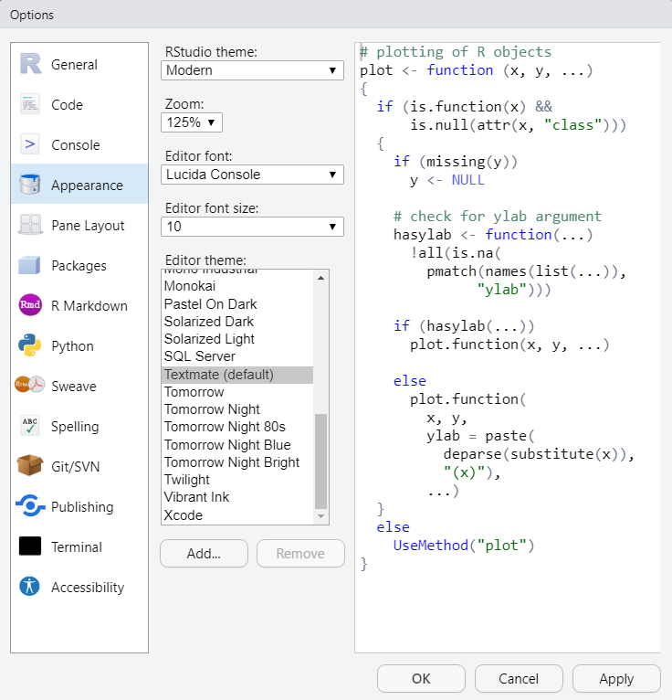
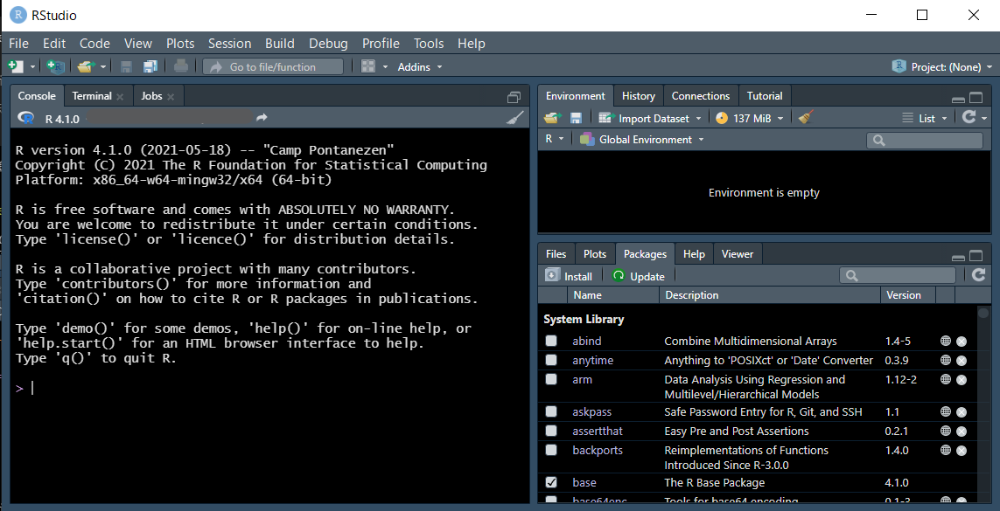
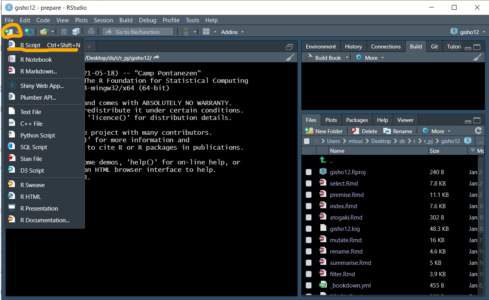
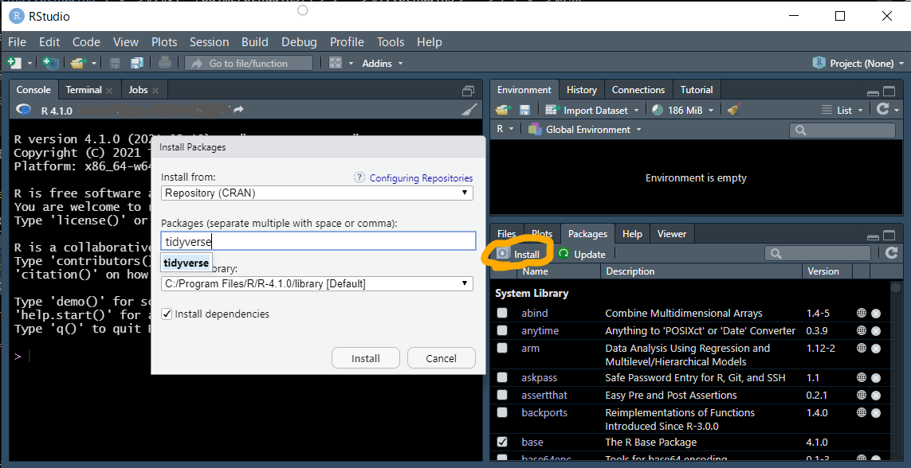
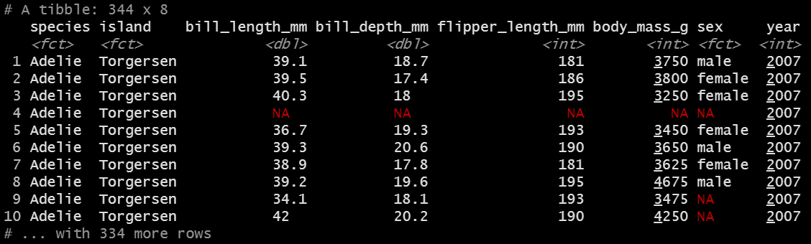
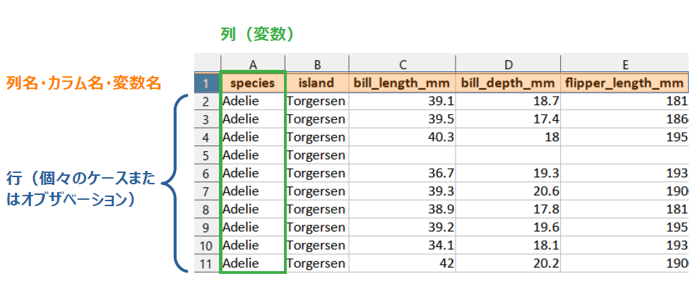

# 前提知識 {#premise}


* ここに出てくる用語は初学者にとってなじみがないものばかりかもしれないが，Rでデータ加工をらくらくできるようになるためには避けて通れない

## RStudioの使い方
### 起動画面

* RStudioを最初に起動すると大体以下のような画面になる

```{r start, echo = FALSE, fig.cap = "RStudioの起動画面", fig.align = "center", out.width='80%'}

```
### 見た目の変更
* 好みまたは目に優しい画面にするため，RStudioの色合いを下記から変更できる
  + メニューの`Tools > Global Options > Appearance > Editor theme`
  + 筆者は`Tommorow Night Bright`を使用
  + 以下の説明は変更後の画面で示す

```{r appearance, echo = FALSE, fig.cap = "テーマの設定画面", fig.align = "center", out.width='70%'}

```

### コードの実行の仕方{#p-howtorun}

* コンソールに直接コードを入力し出力を確認できる
  + ちょっとした確認には便利だが，たくさん書きたい時や，内容を保存したい時は不向き

```{r pane, echo = FALSE, fig.cap = "コンソールに直接", fig.align = "center", out.width='70%'}

```

* R Scriptに書くと，たくさん書けるし保存も簡単でおすすめ。色分けもされる
 + 慣れたらR Markdownを使うともっと楽しくなるかも
* または`File > New file > R Script` 

```{r script, echo = FALSE, fig.cap = "Rスクリプトに書く", fig.align = "center", out.width='70%'}

```

### utf-8

## 本書に出てくるコード部分の見方{#p-howtoread}

* グレーの背景部分はRのコードが書いてあり，その下の`##`で始まる部分は出力結果を表す

```{r}
1 + 1
```

* ここでは`1 + 1`がコード部分で，`## [1] 2`が出力結果部分
* `[1]`というのは，その次にくる値（ここでは１つしかないが）が何番目にあるかを示している
* たとえば，1から50までの数値を出力してみる
  + コロン`:`で最初と最後の値をつなぐことで連番を表現できる

```{r}
1:50
```

* コード部分に`#`で始まる文章がある場合は，コメントを表す。ここは実行されないので説明のために書かれる

```{r}
# *（アスタリスク） は掛け算であることを示す

2 * 3  # ここにもコメントを入れられる
```


## プロジェクト{#p-project}

* データを加工して解析する際に、1つのフォルダ（サブフォルダも含む）の中に関連するデータやコードなどをまとめておき、そのフォルダを**プロジェクト**と設定する
  + これにより、ファイルの読み書きの際の場所指定をいちいち意識しないで作業できるようになる
* RStudio画面の右上にProject設定のメニューがある
  + `Project (None) > New Project > Existing Directory`と選び，プロジェクトにしたいフォルダを設定する（Figure\@ref(fig:project)）  

```{r project, echo = FALSE, fig.cap = "プロジェクトの設定", fig.align = "center"}
knitr::include_graphics("images/project.png")
```


## パッケージ{#p-package}

* 様々な関数やデータなどがまとまっていて，読み込むと色々なことができる
  + 逆にいえば読み込まないと便利な作業ができないことが多い
* インストールされているパッケージはRStudioのデフォルト画面で右下にあるウィンドウ（ペインと呼ぶ）のパッケージタブで確認可能（Figure\@ref(fig:pinst)）  
* 入っていないパッケージは，インターネットにつながっていれば以下の方法でインストールできる
  + パッケージタブの`install`をクリックして出てくるウィンドウでパッケージ名を入力
  + コマンドから`install.packages("パッケージ名をここに入れる")`  
  
  
```{r pinst, echo = FALSE, fig.cap = "パッケージタブからのインストール", fig.align = "center", out.width='80%'}

```

  
* 例：`library(tidyverse)`または`require(tidyverse)` のように書くことで読み込める
* パッケージを読み込まなくても，`パッケージ名::関数名( )`でパッケージ内の関数が使える
  + どのパッケージの関数か明示するのにも便利なので，本書では多用する
  + 以下，例えば「パッケージ`dplyr`の関数`select( )`」は`dplyr::select( )`と表現する
* モダンなRのデータ加工に必須なパッケージをまとめて読み込んでくれる`tidyverse`をまず読み込んでおく
  + 以降のコードはすべて`tidyverse`を読み込んだ前提で進める

```{r eval = FALSE}
library(tidyverse)
```


## 関数{#p-function}

* 適切な値や変数などを指定すれば，データの処理や計算，統計解析など様々な処理を簡単に実行してくれる
  + データ加工の技術は，色々な便利関数をどの場面でどうやって使うかにつきる
* 例えば`mean( )`などのように`関数名( )`で出てくるので，`( )`で囲まれてる所を見たらほぼ関数だと思えばよさそう
* `( )`の中に入る値を**引数**（ひきすう）と呼ぶ
* 引数は`,`でつないで追加していき，これによって実行したい処理のカスタマイズが可能
  + 関数の`( )`の最初の位置に来るものを**第一引数**という

### 例{#p-function-ex}
#### 複数のものを1つにする: c( ){#p-function-ex-c}

* **ベクトル**を作る（複数のものを1つにする）ための関数
  + ベクトルと聞くと数学苦手だった人はいやな記憶を思い出すかもしれないが，Rではとにかく「**複数のものを１つにしたもの**」と理解しておけば何となると思う
* `c()`は慣れてる人は当たり前に使っているので，初学者にとって理解しとくとよい最重要関数と思われる
* ベクトルは，後に解説するデータフレームでの列単位のデータを扱う際にも有用

```{r}
c(1,2,3)

c("a", "b", "c") # " "で囲まれる値は文字を表す

# 複数あるように見えるが実は1つのベクトルになっている例
1:10

```

#### 平均値：mean( ){#p-function-ex-m}

* 引数にベクトルを入れることで平均値を計算する

```{r}
mean(c(1,2,3))

# 欠損値（NA）があると結果がNA
mean(c(1, NA, 3))

# 引数にna.rm = TRUEを追加すると結果が出る
# 基本的に実務上は常につけておいたほうがよい
mean(c(1, NA, 3), na.rm = TRUE)
```


## オブジェクト{#p-object}

* 計算の結果や，複数の数値や文字など（他にも色々）を1つの文字列に格納することができ，その後のコードで活用できる
* `<-`の矢印の先にあるのがオブジェクト。RStudioではショートカット`alt + -`で出せる(Macは`Option + -`)
* この後説明するデータフレームもオブジェクトに入れられる
  + データの少ないミニデータを作る時や，計算結果を格納するときに多用

### 例{#p-object-ex}
```{r}
res <- 1 + 1
res

res2 <- c(1, 2:4, 5)
res2

res3 <- c("a", "b")
res3

rm(res, res2, res3)
```


## データフレーム{#p-df}

* 行（ケースまたはオブザベーション）と列（変数）が碁盤の目のようになった集まりの形のデータ（Figure\@ref(fig:dfr)）
  + Excelで表現するのであれば通常1行目に列名が入り、2行目以降が個別のケース（データ）を表す形。Rのデータフレームでは列名は別途与えられ，1行目からケースが表される（Figure\@ref(fig:dfxl)）
  + データ解析において便利で分かりやすいため、本書ではデータフレームの形で説明していく
  + Rのモダンな方法では，データの加工や統計処理のプロセスをデータフレームの形で返すことが多い
  + 上記のような状態を**tidy**(読み：タイディー，意味：整然)と呼び，データ加工において理想的な形とされている
  


```{r dfr, echo = FALSE, fig.cap = "Rのデータフレーム(tibble形式)", fig.align = "center", out.width='80%'}

```


```{r dfxl, echo = FALSE, fig.cap = "Excel画面風なイメージ", fig.align = "center", out.width='80%'}

```


* オブジェクトに格納することで，別のデータフレームを作れる
* 列単位で取り出すとベクトルになる
* 本書では，データフレームの中でも表示に便利な**tibble**形式を使う
* 本書では紙面の都合上，表示行数をしぼっているが，任意の行数を見たいときは`print( )`関数で出力ごとに設定

### 本書で使う主なデータ{#p-df-main}
#### ペンギンデータ{#p-df-main-p}


* `palmerpenguins`パッケージのpenguinsデータ（CC0）
  + 最初からtibble形式になっている

```{r}
# パッケージが入ってなければ下記実行
# install.packages("palmerpenguins")

palmerpenguins::penguins
```

* tibble形式のデータフレームの出力の見方
  + 出力の最上段にある`A tibble: 344 x 8`で，tibble形式のデータフレーム，344行 × 8列という情報が分かる
  + `flipper_length_~` のように，長い変数名は`~`で省略して表示される
  + 変数名の下の行にある`<fct>`, `<dbl>`, `<int>`は変数の型を示し，それぞれ因子型，数値型，整数型であることを示している。詳しくは\@ref(mu-kata)で説明する
  + 下から2行目にある`... with 341 more rows, and 3 more variables:`で，さらに341行と3列が非表示であることが分かる
  + 非表示になった変数名は最下部に表示される

* tibble形式のデフォルトは最初の10行のみ表示され，本書では最初の3行のみに絞っているが，10行を越えて表示させたい場合は，`print( )`関数を使う

```{r}
palmerpenguins::penguins %>% 
  print(n = 15)
```


## %>% （パイプ演算子）{#p-pipe}

* 名前は**パイプ**で発音は"*and then*" （[参照](https://adv-r.hadley.nz/functions.html#function-composition)）
* コードを読みやすくするための便利な機能を持つ演算子。初めてみた人は全然わからないと思うが，この本を読んでコードを書きはじめてみたらこれなしではいられなくなるくらいお世話になると思う
  + 主に使用が想定される場面でざっくりいうと，「このデータフレームに対して`%>%`の後にある関数を適用する」という機能
  + 具体的な使用法は\@ref(select-standard-pipe)で解説
* RStudioのショートカットは`Ctrl + Shift + M`(Macは`Cmd + Shift + M`)。たぶん，RStudio以外でもこのショートカット押してしまうぐらい中毒性がある
* R version 4.1からは`|>`が大体同じ機能を持つ演算子して実装されたので，特にパッケージの読み込みをせずに使えるようになった。こちらを使う説明も今後増えていくと思われる
  + ショートカットで出るパイプを`|>`に切り替えたい場合は，RStudioの`Tools > Global Options > Code > Editing > use native pipe operator`にチェックを入れる
  + 現時点ではデータフレームを第一引数へ渡す形式でない関数の場合（回帰分析の`lm( )`など），工夫が必要な場合があるようなので，本書では`%>%`を使用